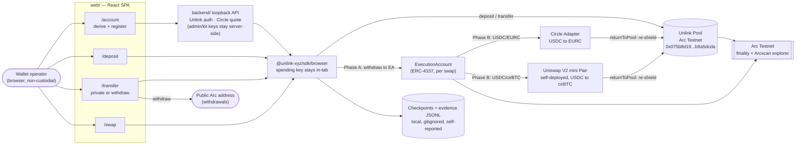

# Clean Privacy for Arc

Private Unlink balances, private Unlink-to-Unlink transfers, and Unlink-funded
swaps on **Arc Testnet** (chain `5042002`), built on the [Unlink](https://unlink.xyz)
protocol and Circle App Kit.

> **Status:** Phases 0–4 (foundation, smoke tests, private transfers, Arc-native
> swaps, application) are complete and verified live on Arc Testnet. Phase 5
> (hackathon hardening) is in progress — see [`ARCHITECTURE.md`](ARCHITECTURE.md) §9.
> Testnet only. No mainnet deployment exists.

## What this actually hides

| Flow | Sender | Recipient | Token | Amount |
| --- | --- | --- | --- | --- |
| Unlink → Unlink transfer | private | private | private | private |
| Unlink-funded swap | private (funding account only) | public (ExecutionAccount) | public | public |
| Deposit / withdrawal | n/a — this leg is public and linkable by design | | | |

An Unlink-funded swap is **not** a fully confidential swap: only the account
that funded it is hidden. The ExecutionAccount address, token pair, amount,
target contract, and calldata are all public on Arc. This project never
claims otherwise, and does not implement or claim KYC gating, A-Pass, or
CleanGate (those belong to a different, unrelated product and are not part of
Arc). Arc's own Privacy Sector is not live and nothing here depends on it.

## Architecture — pipeline



Reading the diagram: every mutation (deposit, transfer, swap, withdraw) is
initiated from the browser via the Unlink SDK, never from the backend — the
backend only issues auth tokens and prepares Circle quote calldata. Swaps are
two-phase: Phase A privately withdraws into a fresh ERC-4337 ExecutionAccount,
Phase B executes the swap publicly from that account and sweeps the output
back into the private pool (`returnToPool`). Every accepted transaction/operation
ID is checkpointed locally before and after submission so a crashed or resumed
session can poll and adopt the same operation instead of duplicating it.

cirBTC swaps are **CLI-only** (`scripts/private-swap.mjs`) — the web app's
swap screen only offers USDC/EURC via Circle App Kit; `requireSwappableToken()`
in `web/src/api/unlinkBackend.ts` rejects cirBTC in the browser.

## Deployed contracts — full transparency

Everything below is Arc Testnet (`chainId 5042002`), taken directly from
[`config/chains.json`](config/chains.json) and
[`deployments/arc-testnet.uniswap-v2-mini.json`](deployments/arc-testnet.uniswap-v2-mini.json).

### Deployed by this repo

Only one thing in this repository has its own deployment transaction: a
minimal Uniswap V2 fork (`@uniswap/v2-core@1.0.1`, unmodified), used as the
fallback swap venue for the USDC/cirBTC pair (Circle App Kit does not route
cirBTC). Deployed and seeded by [`scripts/deploy-univ2-mini.mjs`](scripts/deploy-univ2-mini.mjs),
verified at `2026-07-29T13:04:04.280Z`.

| Contract | Address | Tx hash |
| --- | --- | --- |
| UniswapV2Factory | `0xfa29C0663CF547d089beFcE1925b91f0367a993A` | `0x8252c676f3c30767daaca8e3be4eeaca2d9e5cbe3e119a14b140c14c0a8a5c34` |
| UniswapV2Pair (USDC/cirBTC) | `0x0d2A8c302F74f7df18F845Be1dfA8B9c3507D020` | createPair `0x412a2d30c5408d57292a3ae32bad9be51802e1b1c347baec8105bb72dde138a1` |

- Deployer / LP owner (single testnet EOA, not a multisig): `0xD7E004CBda24E079aA3A657Ba7f8E2915192a966`
- Seed liquidity: 5 USDC + 0.00005 cirBTC (`reserve0=5000000`, `reserve1=5000`, base units)
- Seed tx hashes: USDC `0x037a46341d7392486e26275280f8dd5ecb099db3aa0c6bab4b23ba9db978721b`,
  cirBTC `0x11a4853324a2e11619f73a962dcf0867b3870acde048b27ff43a130bba4cf297`,
  mint `0x76a6ffc2ad5d94fed0ae640b0d49e220285c9cdb201dc207b34ea588ac15fa5d`

This is a testnet-only fallback DEX with trivial liquidity, controlled by one
operator key. It is not audited and is not meant to hold real value.

### Referenced, not deployed by this repo

These are pre-existing Arc Testnet / Unlink / Circle protocol contracts that
`config/chains.json` points at and [`scripts/arc-smoke.mjs`](scripts/arc-smoke.mjs)
verifies has live bytecode before any flow runs. This project does not own,
control, or have deploy rights over any of them.

| Contract | Address | Owner |
| --- | --- | --- |
| USDC (Arc Testnet) | `0x3600000000000000000000000000000000000000` | Arc / Circle |
| EURC | `0x89B50855Aa3bE2F677cD6303Cec089B5F319D72a` | Arc / Circle |
| cirBTC | `0xf0C4a4CE82A5746AbAAd9425360Ab04fbBA432BF` | Arc |
| Unlink Pool | `0x075b8d19b214cd939a0aa6b1eb8e2152b9a5dcda` | Unlink protocol |
| Permit2 | `0x000000000022d473030f116dDEE9F6B43aC78BA3` | canonical Permit2 |
| EntryPoint (ERC-4337 v0.7) | `0x0000000071727De22E5E9d8BAf0eDac6f37da032` | canonical |
| ExecutionAccount factory | `0xc92ac4f6599482d45416e2f9e6ea450cf8c2e410` | Unlink protocol |
| ExecutionAccount implementation | `0xc4f5e6d48eb336bd3f5a54bdfb794da5e20b5069` | Unlink protocol |
| Circle Adapter | `0xBBD70b01a1CAbc96d5b7b129Ae1AAabdf50dd40b` | Circle App Kit |
| Circle Bridge | `0xC5567a5E3370d4DBfB0540025078e283e36A363d` | Circle App Kit |

Protocol fee collector (Unlink account, not a public address):
`unlink1qqvmup67xy2mezvjds0whta4xskl373qgfz9vrrz8xfesg6c7y9g5r029xeyjyzs7fp22htzqzvcjt5wf8zl9lc4pmheg2d4kt95vfr2m522uh`.
Fee owner EOA (swap fee only, paid publicly): `0xD7E004CBda24E079aA3A657Ba7f8E2915192a966`
(same key as the mini-DEX deployer above).

Chain: RPC `https://rpc.testnet.arc.network`, explorer `https://testnet.arcscan.app`.

## Repository structure

| Path | Role |
| --- | --- |
| [`web/`](web) | React/Vite SPA — browser non-custodial UI. See [web/README.md](web/README.md). |
| [`backend/`](backend) | Loopback Node API — Unlink auth + Circle quoting only, never signs. See [backend/README.md](backend/README.md). |
| [`scripts/`](scripts) | CLI reference implementation: deposit, transfer, swap (two-phase), withdraw, recovery, smoke test. |
| [`scripts/lib/`](scripts/lib) | Shared checkpointing, fee math, Unlink/Circle wiring used by the CLI scripts. |
| [`config/chains.json`](config/chains.json) | Single validated chain/address registry (source of truth; the web app's config is generated from this). |
| [`deployments/`](deployments) | Deployment artifacts for contracts this repo deployed itself. |
| [`checkpoints/`](checkpoints) | Gitignored, per-flow operation state used to resume interrupted CLI runs. |
| [`ARCHITECTURE.md`](ARCHITECTURE.md) | Canonical design and delivery record — phase-by-phase source of truth. |
| [`AGENTS.md`](AGENTS.md) | Rules for coding agents working in this repo. |

## Running the CLI reference flow

```bash
npm install
node scripts/arc-smoke.mjs          # read-only: RPC, bytecode, config checks
node scripts/private-deposit.mjs    # public balance -> private Unlink balance
node scripts/private-transfer.mjs   # private Unlink -> Unlink transfer
node scripts/private-swap.mjs       # two-phase Unlink-funded swap
node scripts/private-withdraw.mjs   # private balance -> public Arc address
```

Each script persists a checkpoint before submitting and polls/resumes by ID on
rerun rather than blind-resubmitting.

## Running the web app

```bash
npm --prefix web install
npm --prefix web run dev
```

`VITE_BACKEND_MODE=demo` (default) runs entirely against an in-memory mock —
no real transactions. `VITE_BACKEND_MODE=live` drives the real Unlink SDK
against Arc Testnet. Full routing/deployment notes are in
[web/README.md](web/README.md#routes-and-deployment).

`deployments/evidence/*.jsonl` are self-reported verification logs written by
the scripts after their own on-chain checks — useful as an integration-test
trail, not an independent audit.
